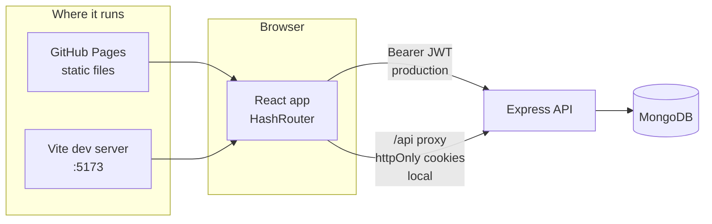
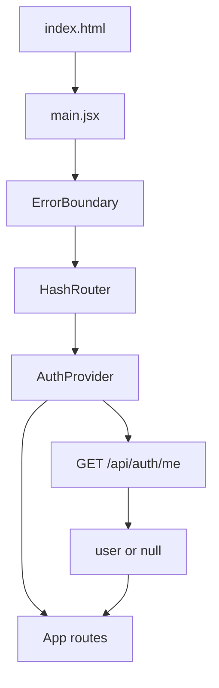
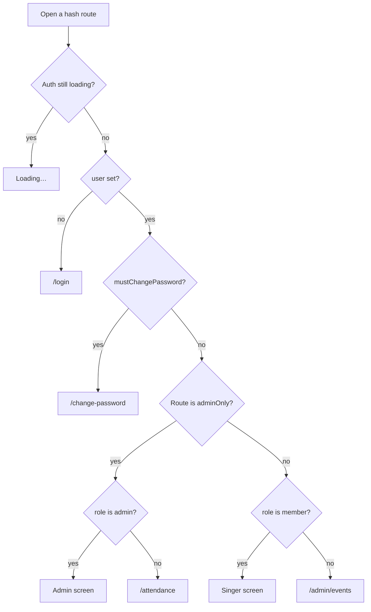
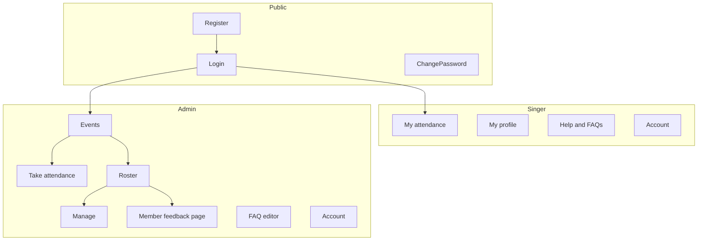
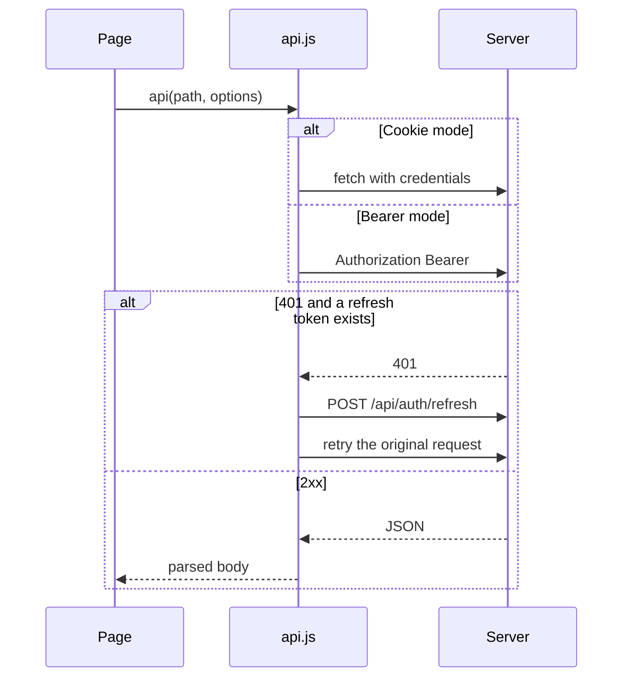
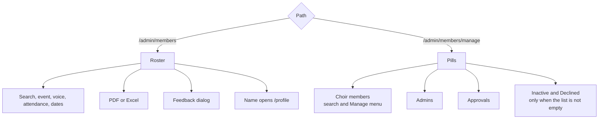
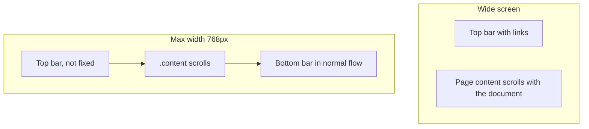

# Architecture

How the choir web app is put together, and how it talks to the API. Operational setup is in the [README](../README.md). Step-by-step journeys are in [end-to-end.md](end-to-end.md).

## System

Locally the browser only talks to Vite. Vite forwards `/api` to `127.0.0.1:4000`, so the API can set cookies for `localhost`.

On GitHub Pages the files are static. `VITE_API_URL` is baked in at build time, and the browser calls Render directly with `Authorization: Bearer` and `X-Auth-Client: bearer`.

## Boot

`AuthProvider` starts a backend warmup ping and loads the current user once. `ProtectedRoute` waits until that load finishes, then redirects.

## Route gates

Public routes (`/login`, `/register`) are outside `ProtectedRoute`. `/change-password` is also outside it, and the page itself sends people who do not need a new password back to their home.

## Screen map

Admin navigation is five links in `AdminHome`: Events, Take attendance, Members, FAQs, Account. Members stays active on Roster, Manage, and a singer's feedback page because those URLs start with `/admin/members`.

## Page data flow

Pages do not read tokens themselves. `api.js` stores them only in Bearer mode.

List responses pass through `src/utils/api-data.js` before they are rendered, so a missing pagination block or an unmarked attendance status has one shape in the UI.

## Members page

One component, two URLs.

Roster data is `GET /api/members/roster` with the filters on screen. The Manage member list is a second call to the same endpoint with only the search box, so an attendance filter on the roster does not hide someone you need to deactivate.

## Layout

Below 768px, `.data-table` is hidden and `.data-cards` is shown. Inputs use a 16px font so iOS does not zoom on focus.

## Build outputs

| Mode | `base` | API |
| --- | --- | --- |
| `npm run dev` | `/` | Proxy to port 4000, cookies |
| `npm run build` | `/` | Whatever `VITE_API_URL` was at build time |
| GitHub Actions | `/attendance-application/` | `VITE_API_URL` from the repository variable |

The production API origin is compiled into the bundle. Changing it requires a new Pages deploy.
