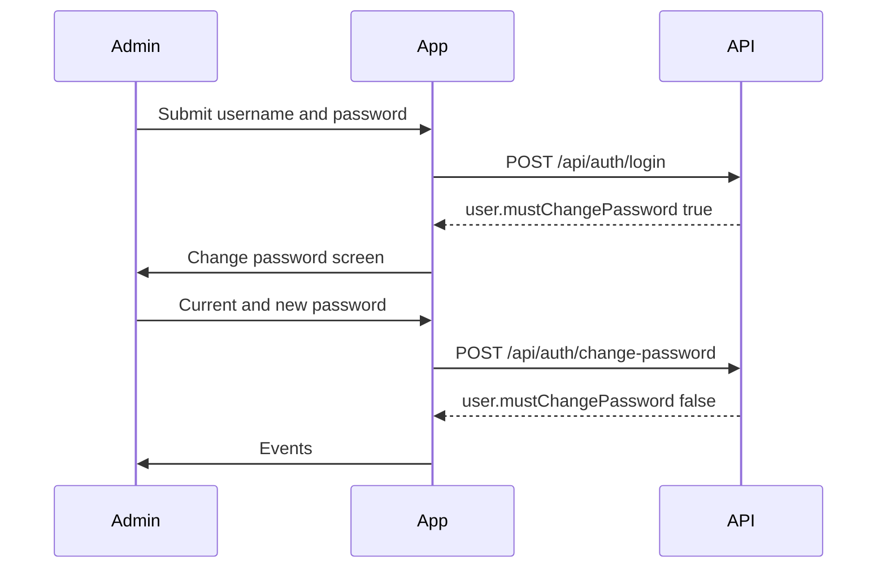
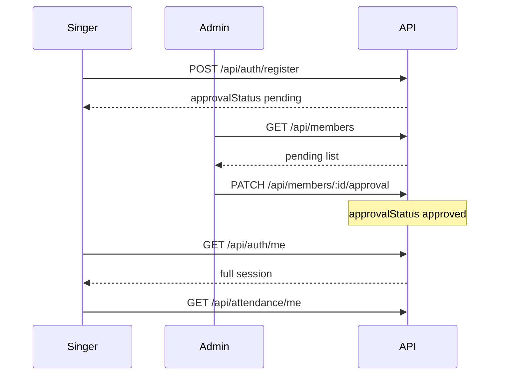
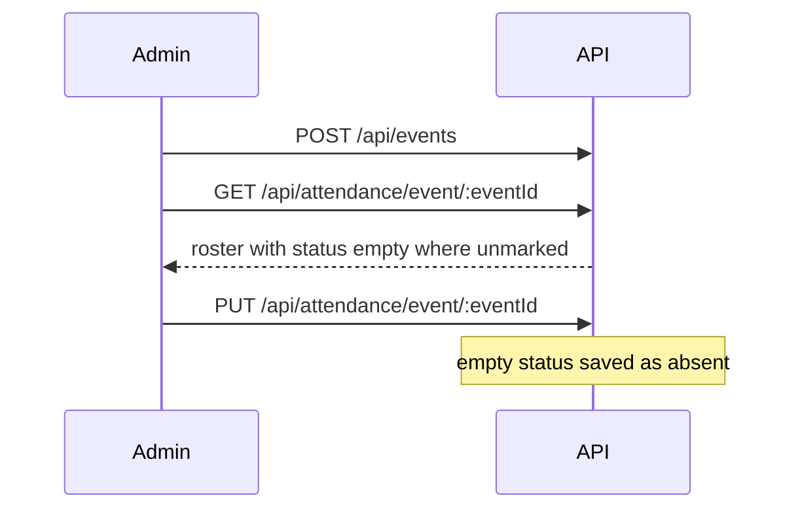
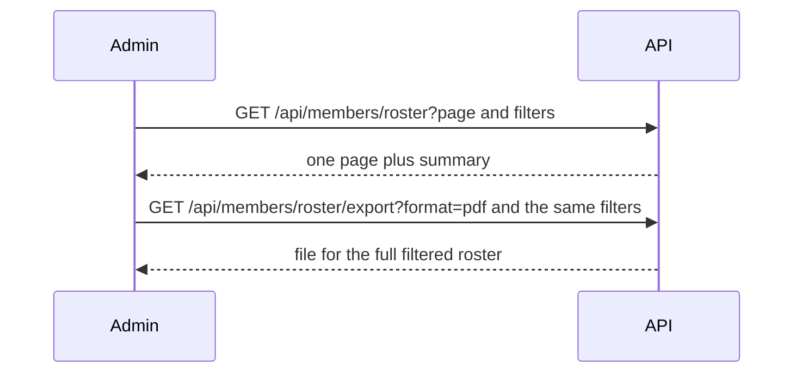
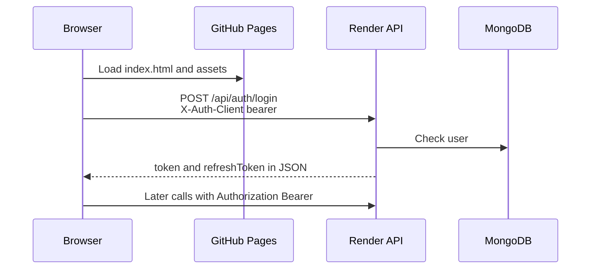

# End-to-end flows

Each flow is what a person does in the app, then the requests that follow. Request and response fields are defined in the server README.

Run both sides locally before walking these through: API on port 4000, this app on port 5173, `VITE_API_URL` empty.

## 1. Local sign-in as admin

1. Open `http://localhost:5173/#/login`.
2. Sign in as `admin` with the seeded password.
3. The API returns `mustChangePassword: true`.
4. The app opens `/change-password`.
5. After a new password, the session scope is `full` and the app opens `/admin/events`.

Later visits call `GET /api/auth/me` before any protected screen renders.

## 2. A singer registers and an admin approves them

1. Singer opens `/register`, chooses a username and password, and submits.
2. The account is `approvalStatus: pending`. The singer can sign in and sees that the account is waiting.
3. Admin opens **Members → Manage → Approvals**.
4. Approve sends the singer to the choir roster. Decline sends them to Declined, and that pill appears because the list is no longer empty.

Pending and must-change-password sessions can call auth routes. Events, attendance, FAQs, and the member profile stay closed until the account is approved and the password flag is clear.

## 3. Admin takes attendance

1. **Events**: create a practice, service, concert, or other event, with an optional liturgical color.
2. **Take attendance**: pick that event. The URL becomes `/admin/attendance/:eventId`.
3. Each singer is unmarked until a status is chosen. Notes stay collapsed until someone adds one.
4. Save writes the roster. An unmarked row is stored as absent.
5. **Next unmarked** scrolls to the next person who still has an empty status.

The roster used here is active, approved singers, plus admins who were kept on the choir roster. An admin marked “Admin only” is not in this list.

## 4. Admin reviews the roster and exports it

1. **Members** opens the Roster, not Manage.
2. Filters narrow by search, event, voice part, attendance status, and dates. Choosing an event ignores the date range.
3. **Export** asks for PDF or Excel and which columns to include.
4. The file uses the current filters and every matching row, not only the current page.

Opening a name goes to `/admin/members/:id/profile`. **Feedback** on the row opens the same record in a dialog: voice range, choir pathway, and a feedback note. Each change is appended to that singer's history.

## 5. Admin manages accounts

1. **Manage** shows pills: Members, Admins, Approvals. Inactive and Declined appear only when someone is in that list.
2. **Members** is every choir account, with search. **Manage** on a row edits the account, deactivates or reactivates it, or deletes it permanently.
3. **Admins** lists admin accounts and whether each one is still on the singing roster.
4. **Add member** creates an approved account with a temporary password.

Deactivate keeps attendance history and blocks sign-in. Delete removes the account and that person's attendance records.

The last remaining admin cannot be demoted. Promoting a singer to admin asks whether they still sing with the choir (`onRoster`).

## 6. Singer checks attendance and exports it

1. **My attendance** loads `GET /api/attendance/me`.
2. Filters match the admin event filters, plus a status filter. An event selection ignores From and To.
3. **Export** downloads PDF or Excel for the full filtered history.

Columns are date, event, type, liturgical color, status, and notes.

When a status filter or a single event is selected, the summary is calculated from those history rows, so a past event with no mark counts as absent in that view.

## 7. Singer reads their profile and the FAQs

1. **My profile** calls `GET /api/auth/my-profile`. It shows the latest voice range, pathway, and feedback, plus the history. Singers do not edit this.
2. **Help & FAQs** calls `GET /api/faqs` and shows published entries whose audience is `member` or `both`.
3. An admin editing FAQs calls `GET /api/faqs?manage=true` and can create, update, publish, or delete entries for `member`, `admin`, or `both`.

## 8. Password and session expiry

| Situation | What the app does |
| --- | --- |
| Seeded admin or imported singer on first login | `/change-password`, then a new session |
| Admin resets a password in Manage | That person must change it on next login |
| Access token expires, refresh still valid | `api.js` calls `/api/auth/refresh` and retries |
| Refresh fails | Clears tokens and opens `/login?session=expired` |
| Sign out | `POST /api/auth/logout`, then the login screen |

## 9. Production path

`CLIENT_ORIGIN` on the API must be `https://st-pauls-malayalam-parish.github.io`. The Pages build must have been made with `VITE_API_URL` set to that Render origin.
